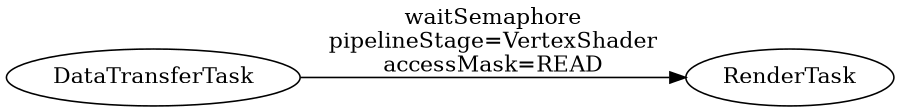

# Render Graph

## Status

proposed

## Context

Currently the window is the owner of the rendering pipeline which contains only predifened renderers. It is the first step to a render graph.

Render Graph contains Tasks as nodes. Similar tasks what CudaCompute has currently. 3 types of Tasks gonna be implemented:
 - RenderTask: Contains a renderer and executs its draw calls. The graph can give access to CommandContexts for the renderers ([Command Context ADR](../command_context.md)).
 - ComputeTask: It can contains whatever kind of compute task. It can be a wrapper around a CudaCompute or later also can use VulkanCompute or the mixture like calling cuda kernel from a vulkan command buffer.
 - DataTransferTask: Uploads or Downloads data from a specific resource. See a bit more in the [Resource Uploader ADR](../resource_uploader.md)

The render graph nodes are connected with edges. An edge is a SyncOperation. I.e.: A set of wait and signal semaphors or fences or events. A simple example one would like to render a texture that can be changed. Then the DataTransferTask is connected with the RenderTask with an edge where a wait operation is defined for a semaphore. When the render command is issued it will wait until the semaphore is not signald.

## Decision

## Consequences

